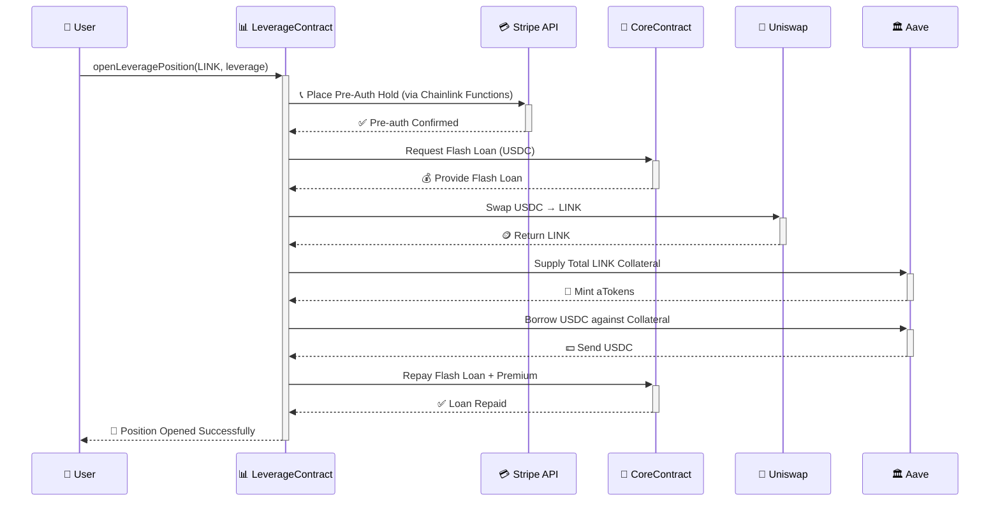
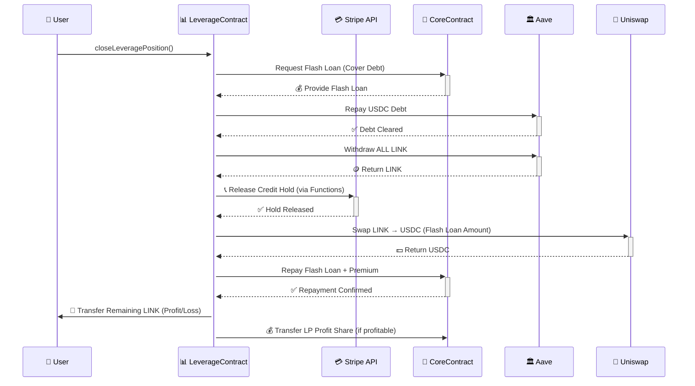
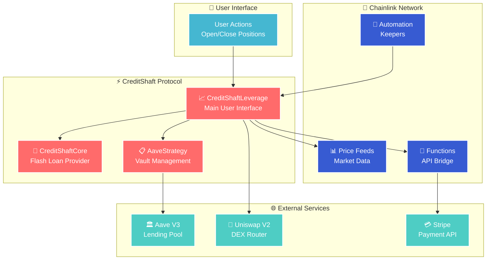

# 🚀 CreditShaft Protocol

> _Bridging DeFi and Traditional Finance through Intelligent Credit-Backed Leverage_

[](https://opensource.org/licenses/MIT)
[](https://chain.link/)
[](https://getfoundry.sh/)

---

## 🎯 What is CreditShaft?

CreditShaft revolutionizes DeFi lending by introducing **hybrid collateralization** - combining on-chain assets with off-chain credit guarantees. Users can leverage their crypto positions while their traditional credit provides an additional safety net, creating a more capital-efficient and secure lending experience.

### Key Innovation

- **💳 Credit-Backed Safety**: Traditional credit cards provide liquidation backstop
- **⚡ Flash Loan Orchestration**: Atomic, gas-efficient position management
- **🔗 Chainlink Integration**: Seamless bridge between on-chain and off-chain worlds
- **🏦 Institutional Grade**: Professional-level risk management

---

## ✨ How It Works

The entire process is atomic and seamless, using flash loans to orchestrate complex actions in a single, secure transaction.

### 🔓 Opening a Leveraged Position

_Where on-chain meets off-chain magic_



### 🔒 Closing a Leveraged Position

_Safe unwinding of all obligations_



---

## 🔗 Chainlink Integration Trifecta

CreditShaft's hybrid security model leverages Chainlink's complete service suite for maximum reliability and trust.

### 🔧 Chainlink Functions

**The Bridge to Traditional Finance**

```typescript
// Core functionality
✅ Create Pre-authorizations    → Secure protocol loans
✅ Capture Funds               → Handle liquidations
✅ Release Holds               → Complete safe exits
```

### 🤖 Chainlink Automation

**The Decentralized Guardian**

```typescript
// Continuous monitoring
✅ Position Health Monitoring  → Real-time risk assessment
✅ Automatic Liquidations      → Trigger when threshold breached
✅ Timeout Management          → Handle 7-day pre-auth expiry
```

### 📊 Chainlink Price Feeds

**The Source of Truth**

```typescript
// Reliable price data
✅ Real-time Asset Valuations  → Accurate risk calculations
✅ Tamper-proof Data          → Secure health factor computation
✅ Multi-asset Support        → LINK, ETH, and more
```

---

## 🏗️ Smart Contract Architecture

Modular design with clear separation of concerns for maximum security and maintainability.



### Contract Responsibilities

| Contract                | Purpose                                    | Key Features                                                                  |
| ----------------------- | ------------------------------------------ | ----------------------------------------------------------------------------- |
| **CreditShaftCore**     | Flash loan provider & liquidity management | • USDC pool management<br/>• Flash loan execution<br/>• Fee collection        |
| **CreditShaftLeverage** | Main user interface & orchestration        | • Position management<br/>• Chainlink integrations<br/>• Risk calculations    |
| **AaveStrategy**        | Isolated Aave interaction vault            | • Collateral management<br/>• Borrowing operations<br/>• Permission isolation |

---

## 🚀 Quick Start Guide

### Prerequisites

```bash
# Required tools
- Foundry (Anvil, Forge, Cast)
- Make
- Git
```

### Installation

```bash
# Clone the repository
git clone <your-repo-url>
cd credit-shaft-contracts

# Install dependencies
forge install
```

### Environment Configuration

Create `.env` file with your credentials:

```bash
# .env file
SEPOLIA_RPC_URL=https://sepolia.infura.io/v3/YOUR_INFURA_ID
PRIVATE_KEY=0xYourPrivateKey
ETHERSCAN_API_KEY=YourEtherscanApiKey
```

### Deployment

```bash
# Deploy to Sepolia testnet
make deploy-sepolia

# Generates: deployments/sepolia.json with contract addresses
```

### Testing the Protocol

Test the complete trade lifecycle:

```bash
# Open a leveraged position
make test-open-position

# Close the position
make test-close-position
```

### 📋 Deployed Contract Addresses (Avalanche Fuji)

The CreditShaft Protocol is deployed and verified on Avalanche Fuji testnet:

| 🔗 Contract | 📍 Address | 🔍 Explorer |
|-------------|------------|-------------|
| **🏦 CreditShaftCore** | `0xdE9DeB7BBEF3d07F3fB0a2c6f86C763a16F650C5` | [View on Snowtrace](https://testnet.snowtrace.io/address/0xdE9DeB7BBEF3d07F3fB0a2c6f86C763a16F650C5) |
| **📈 CreditShaftLeverage** | `0x45452AeeA6f332fC8A846e082a4f8Af00E43A41e` | [View on Snowtrace](https://testnet.snowtrace.io/address/0x45452AeeA6f332fC8A846e082a4f8Af00E43A41e) |
| **📋 AaveStrategy** | `0xA85357e9632aF800C3DA65eb4BB33cb4164c99BA` | [View on Snowtrace](https://testnet.snowtrace.io/address/0xA85357e9632aF800C3DA65eb4BB33cb4164c99BA) |
| **🪙 SimplifiedLPToken** | `0x66cE597C2D42B3D04cdea5bf2cDbd112b9483318` | [View on Snowtrace](https://testnet.snowtrace.io/address/0x66cE597C2D42B3D04cdea5bf2cDbd112b9483318) |

> 💡 **Quick Access**: Click any address to view the contract on Snowtrace explorer with full transaction history and verification status.

---

## 🛣️ Roadmap

### Phase 1: Core Features ✅

- [x] Flash loan infrastructure
- [x] Basic position management
- [x] Chainlink integrations

### Phase 2: Enhanced Functionality 🔄

- [ ] Complete liquidation engine
- [ ] Advanced risk management
- [ ] Position health dashboard

### Phase 3: Scaling & UX 📋

- [ ] Web interface development
- [ ] Mobile application
- [ ] Advanced trading features

### Phase 4: Multi-Asset Support 🎯

- [ ] Additional collateral types (wstETH, WBTC)
- [ ] Multiple yield strategies
- [ ] Cross-chain compatibility

---

## 🔐 Security Considerations

```typescript
// Security Features
✅ Flash loan atomicity        → All-or-nothing execution
✅ Modular architecture        → Isolated contract responsibilities
✅ Chainlink price feeds       → Tamper-proof market data
✅ Automated monitoring        → 24/7 position surveillance
✅ Credit backstop             → Traditional finance safety net
```

> **⚠️ Important:** This is a hackathon project for demonstration purposes. The code has not been audited and should not be used in production with real funds.

---

## 🤝 Contributing

We welcome contributions! Please see our [Contributing Guidelines](CONTRIBUTING.md) for details.

### Development Workflow

```bash
# Run tests
forge test

# Code formatting
forge fmt

# Gas optimization analysis
forge test --gas-report
```

---

## 📄 License

This project is licensed under the MIT License - see the [LICENSE](LICENSE) file for details.

---

## 🙏 Acknowledgments

- **Chainlink Team** for providing the infrastructure that makes this possible
- **Aave Protocol** for robust lending primitives
- **Foundry** for excellent development tooling
- **The DeFi Community** for continuous innovation

---

<div align="center">

**Built with ❤️ for the future of decentralized finance**

[Documentation](docs/) • [Discord](https://discord.gg/creditshaft) • [Twitter](https://twitter.com/creditshaft)

_Bridging Traditional Finance and DeFi, One Credit Line at a Time_

</div>
